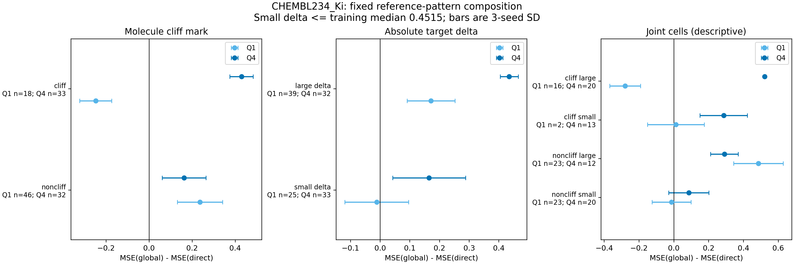

# D2：活性差值与分子cliff构成

仅检验D1按固定优先级选出的`{'dataset': 'CHEMBL234_Ki', 'treatment': 'global', 'reference': 'direct'}`；没有改分层或另选候选。

差值幅度界限为已记录训练配对的中位绝对差`0.45154499`；
small为不大于该值，large为大于该值。没有根据验证误差选界限。
cliff是分子标记，不代表当前参考对构成cliff。

误差条为同一划分上3个训练seed的SD；横坐标是处理−对照MSE，正值表示global更差。

## 全部子组检查

gap仍定义为Q1处理−对照差减Q4同一差。只有两端各至少20分子、3seed及最大误差差删除后
都保留D1方向的子组，才作为下一步的信息依据。joint只描述，不额外搜索子组。

|分组|子组|Q1数|Q4数|seed42 gap|seed43 gap|seed44 gap|删除后方向一致|够样本|稳定|
|---|---|---:|---:|---:|---:|---:|---|---|---|
|molecule_cliff|noncliff|46|32|+0.1527|+0.0516|+0.0158|否|是|否|
|molecule_cliff|cliff|18|33|-0.6011|-0.8221|-0.6080|是|否|否|
|delta_magnitude|small_delta|25|33|-0.1663|-0.1941|-0.1691|否|是|否|
|delta_magnitude|large_delta|39|32|-0.1612|-0.3036|-0.3265|否|是|否|
|joint|noncliff_small|23|20|-0.0916|-0.1030|-0.1045|否|是|否|
|joint|noncliff_large|23|12|+0.3375|+0.1654|+0.0833|否|否|否|
|joint|cliff_small|2|13|-0.3531|-0.3755|-0.0950|是|否|否|
|joint|cliff_large|16|20|-0.7384|-0.9044|-0.7648|是|否|否|

稳定子组：`{'molecule_cliff': [], 'delta_magnitude': []}`。

阶段决策：`pause_composition_evidence_insufficient`。

继续D3要求cliff划分和差值大小划分各至少一个稳定子组；任何不满足都按用户授权暂停。
这种一致性是筛选信息价值，不是因果、显著性或泛化证明。小样本子组保留数值但不用于通过门槛。
即使一个子组稳定，也不能推出该子组所有分子都退化，或仅凭本结果决定训练配对阈值。
