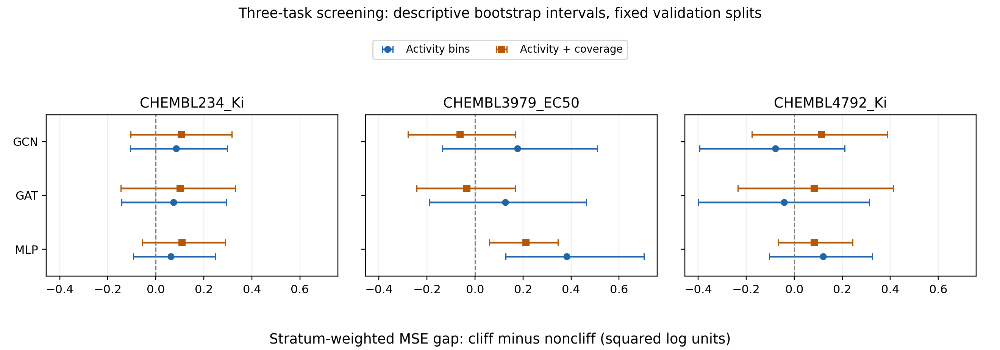

# 三任务固定分层误差筛查（2026-10-05）

结论：**No-Go，结束此候选诊断，不据此启动新 Loss 训练。** 27组既有验证预测形成18个对比；只有 MLP/CHEMBL3979_EC50 同时满足两种分组的条件，未达到至少两个相同模型在至少两个任务重复的继续门槛。中科院二区发表仍是最终目标，本轮没有形成新方法贡献或可投稿的性能结论。

## 输入与复用边界

输入：`D:/WORK_SPACE/WORK_SPACE/my_work/graphcliff_baselines` 的 GCN/GAT/MLP，三个任务各 seed42/43/44，共27组已保存 validation 预测。数据身份来自 `D:/GraphCliff-main/benchmark_data`；复用 `tools/reuse_baselines.py` 的身份核对及 `graphcliff_pair.data` 的 Morgan/Top1 接口。三个种子共享固定验证集，不作为独立数据重复。仅比较现有基线：另两任务没有合格的新 GraphCliff 对照，因此未加入 GraphCliff，也未重训、重建基线。

输出：本目录公开聚合结果、来源哈希、身份审计及图；逐分子标签、SMILES、预测、bootstrap原始抽样和权重留在本机忽略目录 `D:/GraphCliff-Pair/artifacts/matched_cliff_20261005`。本轮未读取官方test标签或旧test预测；文件字节哈希核对不涉及test标签评估。

## 分析前固定的规则

训练活性20/40/60/80%分位数定义五个区间；训练分子 leave-one-out Top1 相似度中位数定义两种邻居覆盖，Morgan半径2/1024位，排除自身与canonical相同分子。主比较按活性区间分层，辅助比较再加覆盖层。每格cliff/noncliff均至少3分子才保留，格权重与两类较小数量成正比；每类保留至少20分子且至少原类50%才解释。

每个seed单独计算格加权的 cliff−noncliff 平方误差差。三个seed平方误差按分子取平均用于描述区间，这不是预测集成。格内按类重采样1000次，seed20261005，固定数量/权重；同一任务和设计的模型共用抽样行。表中方括号为bootstrap的2.5%/97.5%分位数，不是多重比较校正后的显著性证据。

继续条件：至少两个相同模型在至少两个任务中，主/辅助均支持充足、三个seed差值均正、描述区间下界均大于0。这是项目的信息筛查规则，不是期刊发表标准。本次在此前探索之后固定规则，不称独立预注册确认试验；不因失败重分组、增任务或训练寻找阳性。

## 结果

| 任务 | 模型 | 活性分层差值 [描述区间] | 活性+覆盖差值 [描述区间] | 两项均通过 |
|---|---|---|---|---|
| CHEMBL234_Ki | GCN | 0.085 [-0.107, 0.297] | 0.106 [-0.104, 0.317] | 否 |
| CHEMBL234_Ki | GAT | 0.073 [-0.142, 0.295] | 0.100 [-0.145, 0.331] | 否 |
| CHEMBL234_Ki | MLP | 0.063 [-0.093, 0.247] | 0.108 [-0.056, 0.290] | 否 |
| CHEMBL3979_EC50 | GCN | 0.177 [-0.135, 0.510] | -0.064 [-0.279, 0.170] | 否 |
| CHEMBL3979_EC50 | GAT | 0.126 [-0.190, 0.464] | -0.035 [-0.243, 0.167] | 否 |
| CHEMBL3979_EC50 | MLP | 0.382 [0.128, 0.703] | 0.212 [0.059, 0.345] | 是 |
| CHEMBL4792_Ki | GCN | -0.078 [-0.394, 0.210] | 0.113 [-0.176, 0.389] | 否 |
| CHEMBL4792_Ki | GAT | -0.042 [-0.401, 0.313] | 0.082 [-0.234, 0.412] | 否 |
| CHEMBL4792_Ki | MLP | 0.120 [-0.103, 0.325] | 0.082 [-0.066, 0.243] | 否 |

正差值代表cliff误差较大，单位为平方log活性；不是RMSE增益。所有18个对比均有足够支持。234保留cliff/noncliff为128/164（两设计相同）；3979由37/52变为32/45；4792由63/54变为51/42。3979的GCN/GAT加覆盖层后点估计由正变负，两边区间均跨0；这体现分层敏感性，不构成覆盖导致误差变化的因果证据。



## 核验、局限与下一步

标准库独立核验器从27个原始预测文件重新读取4482行，重算18组支持/格权重、54个seed差值、18个bootstrap百分位区间和决策。最大差2.36e−16；184个输入文件SHA256未变化。身份核对包括训练/验证行号、SMILES、标签、cliff标记及划分，无canonical训练/验证重叠。保存权重、预测等匹配历史manifest，但旧 `models/neural.py` 当前哈希与训练manifest不同，故不称当前源码严格复现；本轮也未重放模型。

只有三个既有任务、一个固定划分且验证已多次探索；粗分层仍有格内差异，化学系列依赖未由分子级bootstrap处理，不能据区间跨0断言cliff额外误差不存在。支持阈值和重采样只是描述筛查，不验证创新、因果或投稿充分性。

本轮结束该诊断支线，旧目标和队列保持暂停。DIR/BalancedMSE此前只通过接口合成核验，不能据此声称分子性能提升；不立即训练BMC/LDS或继续加模块。下一个有价值的里程碑应是一个与已有文献明确区分的最小算法对照及停止门槛；当前没有确认合格候选，论文目标仍未完成。

核验命令（需本机原始输入和忽略产物）：

```powershell
python tools/verify_matched_cliff.py artifacts/matched_cliff_20261005
```

工具：`tools/matched_cliff_audit.py`（prepare/analyze）与 `tools/verify_matched_cliff.py`。本轮新增这两个分析工具及本目录，更新README/task_plan/notes/milestones；模型、Loss、训练配置、原GraphCliff源码与my_work基线均未修改。

## 工作流来源

`experimental-design` 技能用于固定比较、重复单位与停止条件；引用仅说明工作流来源，不作为本分析统计有效性的证明：Kassis, T., Agarwal, V., He, Y., Patel, D., & Brueckner, A. M. (2026). *Scientific Agent Skills: A Library of Procedural Knowledge for Research Agents*. [arXiv:2609.00065](https://doi.org/10.48550/arXiv.2609.00065).
