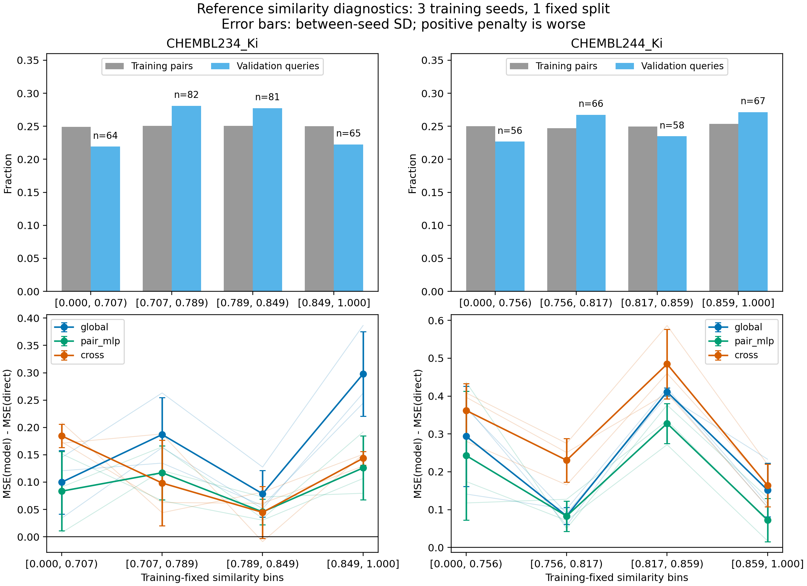

# D1：参考相似度与性能退化

仅使用已审计输出，不读取源CSV或test标签；D0的42组文件身份、指标和样本对齐检查通过。
分层由训练配对相似度四分位数预先固定，边界重复时合并。当前候选筛选是探索性的，不是因果或显著性检验。

图中误差条为同一固定划分上三个训练seed之间的SD，不是置信区间；逐seed细线也全部保留。

## 固定的筛选规则

比较最低与最高相似度层的配对平方误差差。候选须两层均至少20分子，三seed方向一致，
各层剔除最大绝对误差差样本后方向仍一致，并且平均层间差达到direct总体MSE的5%。
20样本和5%是本轮预先固定的实用筛选门槛，不是论文参数、功效保证或显著性界限。

## CHEMBL234_Ki

边界：`[0.0, 0.7073170731707317, 0.7894736842105263, 0.8492924528301887, 1.0]`。

|层|分子数|cliff分子数|direct RMSE|global RMSE|MLP RMSE|cross RMSE|参考标签 RMSE|
|---|---:|---:|---:|---:|---:|---:|---:|
|Q1|64|18|0.7798|0.8408|0.8310|0.8904|0.9592|
|Q2|82|29|0.5888|0.7314|0.6820|0.6678|0.7759|
|Q3|81|48|0.5597|0.6253|0.5989|0.5976|0.7104|
|Q4|65|33|0.4780|0.7259|0.5962|0.6105|0.6969|

上表模型RMSE为逐seed RMSE的均值。参考标签对照无训练随机性，仅一个划分，
不把相同参考预测称为三次独立重复。

## CHEMBL244_Ki

边界：`[0.0, 0.7564102564102564, 0.8166666666666667, 0.859375, 1.0]`。

|层|分子数|cliff分子数|direct RMSE|global RMSE|MLP RMSE|cross RMSE|参考标签 RMSE|
|---|---:|---:|---:|---:|---:|---:|---:|
|Q1|56|17|0.9266|1.0726|1.0475|1.1046|1.2022|
|Q2|66|30|0.7210|0.7765|0.7760|0.8657|0.8407|
|Q3|58|30|0.6131|0.8871|0.8385|0.9269|0.9807|
|Q4|67|41|0.6245|0.7341|0.6799|0.7442|0.7916|

上表模型RMSE为逐seed RMSE的均值。参考标签对照无训练随机性，仅一个划分，
不把相同参考预测称为三次独立重复。

## 各候选的完整检查

gap = Q1的MSE处理−对照差 − Q4的同一差；正值代表低相似度层更不利。

|任务|处理−对照|seed42 gap|seed43 gap|seed44 gap|占direct MSE|删除极端样本仍一致|通过|
|---|---|---:|---:|---:|---:|---|---|
|CHEMBL234_Ki|global−direct|-0.1237|-0.2416|-0.2288|53.7%|是|是|
|CHEMBL244_Ki|global−direct|+0.1347|+0.0258|+0.2664|27.0%|否|否|
|CHEMBL234_Ki|cross−global|+0.1818|+0.2621|+0.2732|64.8%|是|是|
|CHEMBL244_Ki|cross−global|+0.1557|+0.0886|-0.0770|10.6%|否|否|
|CHEMBL234_Ki|cross−pair_mlp|+0.0131|+0.1211|+0.1165|22.6%|是|是|
|CHEMBL244_Ki|cross−pair_mlp|+0.1333|+0.0658|-0.1157|5.3%|否|否|

当前决策：`continue_D2`。

候选优先级在分析前固定为global−direct、cross−global、cross−MLP，各对照内按234、244任务顺序。
仅继续首个通过候选的D2检查，不挑选最有利的阈值；所有候选与反例均保留。
如果没有候选通过，按用户授权立即暂停，D2/D3和后续训练均不启动。
当前结果仅限这两个开发任务和当前实现；每层的cliff数是分子标记，不是查询—参考对标签。
