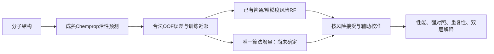

# 给老师的研究进展汇报：GraphCliff模块探索与预测可靠性研究

日期：2026年10月6日。汇报身份：已完成工作与探索性结果总结，不是投稿成稿或新实验方案。

## 先讲结论

我已经完成成熟模型复用、多个模块改动、有限多种子对照及失败分析。早期主线是改进GraphCliff的活性预测，后期主线转为固定Chemprop预测器、改进预测风险估计。**有条件性正向结果和可复用底座，但尚未形成经过验证、可以作为论文核心的算法创新。** 当前没有开展30任务完整新方法实验，也没有完成最终双层可解释性。

不是完全没有收益：残差FPPool、某些Pair-FPPool和粗糙度风险增强有正向信号。但更强对照、跨任务表现或解释检查削弱了把这些信号写成通用贡献的理由。因此停止了具体候选的扩大训练，保留全部成果，下一步需要重新明确唯一算法问题。

## 1. 从哪里开始，以什么为基准

初始主干为[GraphCliff官方实现](https://github.com/dmis-lab/GraphCliff)，论文/仓库标题为“GraphCliff: Short–Long Range Gating for Modeling Critical Activity Changes Caused by Subtle Molecular Differences”。编码层同时采用局部ShortGINE与长程LongPoly，经原子级门控组合，然后图读出预测单分子活性。标题及机制由官方README核对；本次未确定其正式期刊信息，不虚构分区/DOI。

数据与评价框架主要使用[MoleculeACE](https://github.com/molML/MoleculeACE)：30个靶点任务的活性悬崖基准，基础论文为van Tilborg等的“Exposing the Limitations of Molecular Machine Learning with Activity Cliffs”，JCIM2022，DOI10.1021/acs.jcim.2c01073。我们的候选先导通常只覆盖少量指定任务，**不是已经完成全部30任务的新方法验证**。

基准有两种含义：GraphCliff是早期代码/结构底座；每次候选的数值比较则使用该次同期、同角色、对应seed的本地对照。不能把作者论文成绩、本地验证成绩、不同划分、单分子和分子对指标混成统一排行榜。

项目边界：当前开发与公开日志在`D:/GraphCliff-Pair`；原GraphCliff为`D:/GraphCliff-main`；旧基线为`D:/WORK_SPACE/WORK_SPACE/my_work/graphcliff_baselines`。本次汇报整理不修改原项目或旧基线。

## 2. 改了哪些模块，灵感与实际复用分别是什么

| 路线 | 实际改变 | 来源/灵感与复用身份 |
|---|---|---|
| 直接FPPool | 改GraphCliff图读出，把原SAG读出换为指纹归属引导聚合；编码主干保留 | [FPPool](https://github.com/shenwxlab/FPPool)，标题“Bridging Molecular Fingerprints and Graph Neural Networks through Knowledge-Guided Pooling”；复用固定pooling.py及薄适配，不是从零发明池化 |
| 残差FPPool | 保留原读出信息的残差式指纹聚合方案；检查真实/置乱membership，加入GMT读出对照 | FPPool启发＋项目自己的残差适配/对照，不称作者原方案精确复现；README期刊字段XXXX，正式出处本次未核实 |
| 编码后Cross-Attention | 查询与训练参考分子先共享GraphCliff编码，然后在原子表示间双向注意力，再读出预测差值 | 复用GraphCliff与PyTorch nn.MultiheadAttention；局部实现是薄适配，不绑定某篇特定Cross-Attention原论文，也没有声称复现MTPNet |
| 逐层替换LongPoly | 另一个独立试验：把长程分支替换为跨分子交互，与同期full/short比较 | GraphCliff双分支结构上的本地替换；与上面的编码后注意力不同，还改变参数/LayerNorm/dropout，不能隔离为纯注意力贡献 |
| Pair-FPPool＋动态Loss | 分子对读出可选FPPool；差值MSE按真值差幅度加权，权重随epoch warm-up | 指纹聚合复用FPPool；动态权重为本地自定义候选，代码明确不是某篇论文精确实现，不称自适应不确定度或元学习 |
| Component-aware辅助差值Loss | 原单分子GraphCliff增加合法训练分子对差值监督；比较balanced/uniform/permuted | 本地组件/差值监督候选，未绑定唯一外部算法出处；它与参考驱动的Pair推理不同 |
| ACA迁移 | 在GraphCliff主任务上加入三元组潜空间约束 | [ACANet](https://github.com/shenwanxiang/ACANet)与[对应Nature Communications论文](https://www.nature.com/articles/s41467-026-75713-2)，DOI10.1038/s41467-026-75713-2；复用官方Loss类，但本地主任务用MSE，不是原论文全部MAE协议复现 |
| Chemprop＋粗糙度风险RF | 固定点预测器，在OOF误差上学习风险；普通5特征再加邻域离散度/SALI两特征 | [Chemprop](https://github.com/chemprop/chemprop)官方D-MPNN；[粗糙度作者仓库](https://github.com/krishnatheaverage/qsar-landscape-roughness)纯特征函数；[UNIQUE](https://github.com/Novartis/UNIQUE)多特征误差回归思路，实际风险训练是记录配置的sklearn薄适配，不是运行整套UNIQUE |
| 组件均衡粗糙度 | 邻域活动离散度改成等组件汇总，SALI按非空组件对块等权；支持量保持公平 | 作者粗糙度基础＋结构组件/常规组均衡启发；对照简单组权重RF。不是Group DRO复现，也不声称首次提出组均衡 |

关键澄清：**双通道替换确实试过，但不是所有Cross-Attention实验都替换了双通道。** 编码后交互保留原编码器；逐层LongPoly替换属于另一组试验。分子对模型预测差值，最终用合法训练参考的活性加回差值恢复查询活性，查询真值不作为推理输入。

动态Loss实际形式为w=1+alpha(epoch)*min(|真实差值|/scale,cap)，再按batch均值归一化。所谓“动态”指epoch调度，不是根据当前预测误差在线学习权重。

粗糙度灵感还来自用户提供的AIDD Idea Atlas19页立项PDF：它关注局部结构—活性粗糙度能否跨系列/时间改善QSAR拒答。**这是课题立项稿，不是已发表方法或我们已完成的结果。** 已全文核对；系列/时间严格复核尚未完成，不能说原课题已经被证伪。

已有仓库粗糙度稿件标题为“Local structure--activity landscape roughness detects the activity-cliff failure mode that standard QSAR reliability methods miss”（执行时固定91522b8版本）；目前README标题略有变化，正式发表状态未确认。可部署的粗糙度仍需要合法训练邻居的活性，只是不需要查询真实活性，不能称完全无标签。

## 3. 有什么用：把实际结果讲清楚

下表“改善”统一为100×(对照误差−候选误差)/对照误差，正为好。各行只在自己的任务/同期对照内可比；任务编号省略CHEMBL前缀，完整任务及数值见[历史聚合](../../research/module_pause_review_20261006/comparisons.json)。

| 路线 | 已完成范围 | 关键结果 | 判断 |
|---|---|---|---|
| 直接FPPool | 3979_EC50，3seed | Cliff RMSE 0.675169→0.690374，退化2.25%；Overall退化1.58% | 当前直接替换无稳定收益，停止 |
| 残差FPPool | 2047_EC50/235_EC50/287_Ki，3seed | Cliff相对原读出−2.99%/+1.00%/+2.24%；对GMT在2047/287 +3.12%/+2.59% | 有条件收益，目标/机制证据混合；不称全面有效 |
| 编码后Cross-Attention | 234/244_Ki，3seed；4臂共24次 | Cliff对direct −12.24%/−25.54%；对非交互pair_mlp −1.79%/−9.86% | 非注意力Pair对照更强，归档 |
| LongPoly逐层替换 | 234/244_Ki，各1seed | 对同期full：234 Overall+3.79%、Cliff+0.08%；244 Overall−1.16%、Cliff−4.93% | 非稳定胜出，且容量等变化未完全隔离 |
| Pair-FPPool | 234/244_Ki，已完成42/43 | global_fp对global的Cliff +8.65%/−12.66%；cross_fp −1.79%/−6.55% | 收益依赖任务与上下文，不恢复完整队列 |
| 动态差值Loss/三模块 | 部分42/43，未全矩阵 | global_dynamic Cliff −1.06%/−14.31%；整套cross_fp_dynamic对direct 234−22.60%（2seed），244−33.53%（1seed） | 没有统一优势；单/双seed不能混作三seed确认 |
| Component-aware辅助Loss | 234/244_Ki，3seed，4臂24次 | balanced对MSE Cliff +1.14%/−1.57%，对uniform −2.03%/−1.12% | 特定权重贡献缺支持；不继续搜lambda |
| ACA迁移 | 234_Ki，3seed、2臂6次 | Cliff−3.01%、Overall−4.55%；244仅部分运行 | 当前迁移不值得扩大，不否定原ACANet论文 |
| 粗糙度风险增强 | 234/244/4792_Ki，seed42 | 六接受率RMSE均值改善2.08%/2.49%/3.76% | 有额外风险信号，但仍是特征增强，非已验证算法创新 |

补充正向：3979残差FPPool的单seed Cliff改善6.81%，但Overall退化3.20%，不能挑前者做完整贡献。指纹membership真/置乱在287支持真实分组、2047却相反；解释也没有统一变好。不能说所有FPPool都失败，也不能从一个任务有效推导通用机制。

原三模块计划78次正式运行，独立完成56次，CUDA故障后的14份恢复副本不算新实验，seed44未启动；不声称完整三种子因子矩阵。历史审计223条产物包含冒烟和副本，不是223次独立正式训练。[复核报告](../../research/module_pause_review_20261006/report.md)保留细分停止原因。

最新风险候选的公平比较见下表：主指标是六接受率RMSE均值，低为好，不是点模型RMSE。

| 任务 | 普通风险RF5维 | 粗糙度增强7维 | 去均衡9维 | 组件均衡候选9维 | 均衡相对去核心改善 |
|---|---:|---:|---:|---:|---:|
| CHEMBL234_Ki | 0.728290 | 0.713141 | 0.709146 | 0.703701 | +0.768% |
| CHEMBL244_Ki | 0.875086 | 0.853321 | 0.849909 | 0.871810 | −2.577% |
| CHEMBL4792_Ki | 0.759667 | 0.731103 | 0.723635 | 0.732848 | −1.273% |
| 三任务等权宏均值 | 0.787681 | 0.765855 | 0.760897 | 0.769453 | −1.125% |

候选对普通RF宏改善2.314%，但对同容量/支持量去核心宏退化1.125%；不能只选择较弱普通RF讲正向。组件均衡已经实跑9次RF拟合，12份reference-only图/特征重放通过，核心实际激活；当前停止的是这个具体运算扩展，不是因为“没写出来”。完整六臂见[先导结果](../../research/component_roughness_pilot_20261006/report.md)。

## 4. 指标是什么，为什么后来方向变了

早期主指标：Overall RMSE（全体分子活性误差）、Cliff RMSE（悬崖分子子群误差），都越小越好。合法pair差值误差用来补充分析；分子对共享分子，不能把边当独立样本做显著性包装。

后期主指标：按风险从低到高排序，在接受50%、60%、70%、80%、90%、100%的查询时计算RMSE，对六点取均值。点预测固定，只改变接受顺序，评价“哪些预测值得接受”，不是直接把活性预测网络变准。固定比例避免某方法通过拒绝更多样本获不公平优势。**离散六点均值不等于连续AURC，旧结果不能改名。** 辅助报告区间覆盖/宽度、全体误差、cliff子群及成本；目前未做完整强ensemble/MVE对照。

方向调整是因为早期多模块在强对照下收益混合且成本增加；风险底座出现三任务一致小幅正向信号，适合低成本核对。但“风险增强有效”和“该增强有方法原创贡献”是两件事。后者仍是瓶颈，不需要彻底解决所有活性悬崖才能写论文，但需要一个可信的有限贡献。

## 5. 目前实际框架、在做什么

当前已完成M40投稿资产与缺口清点：30个旧Chemprop任务模型、27组旧GCN/GAT/MLP资产、当前12个Chemprop权重和9角色缓存均可追溯，359项存在/hash检查通过。**资产可复用，不等于历史validation可作独立校准或已经完成当前三seed风险实验。**

目前正在收束阴性路线、整理可供选题和写作的证据，而不是后台继续跑三板斧或30任务。局部均衡与旧模块队列均停止扩展；下一研究工作建议保留Chemprop与可靠性主线，允许离开粗糙度这一具体机制，先定位一个已有数据支持的算法问题。转活性预测方法是另一待明确的分支，尚未实施。

## 6. 做到什么程度，哪些还没做

| 已完成 | 尚未完成 |
|---|---|
| 独立公开项目、固定代码来源及哈希、原项目只读 | 经近邻比较和实验验证的最终算法核心 |
| 上述模块适配与有限正式对照，强对照和阴性保留 | 新方法30任务×3seed完整矩阵 |
| Chemprop合法三折OOF、风险学习/校准/评价角色，三任务seed42缓存 | 新两seed确认、严格系列/时间独立验证 |
| 粗糙度块置乱：18预算内17份接受结果，第三任务4/5重复 | 完整置乱确认；不能补写缺失或改成训练活动置换 |
| 结构依赖图/组件角色与CARA元数据可行性核对 | 有可靠日期的时间外队列；当前缺字段 |
| 历史解释诊断＋M39全部9例、180随机邻域掩蔽 | 最终模型原子/子结构归因、忠实度和跨seed稳定性 |
| 多次停止报告、资产/表格一致性、公开GitHub日志 | 可直接提交的论文全文、期刊匹配与录用 |

M39解释是有限风险证据敏感性：展示成功/失败/一般、结构与合法邻居，数值重放通过；没有通过完整原子解释检查，不用漂亮热图冒充化学机制。M30没有发现固定分组内的MAE/MSE逆序，M31没有发现假设的低相似度增强退化；它们只限制窄机制，不否定整个AIDD原题。参考规模迁移效应仍未验证。

准确阶段：**已完成底座与多条候选的先导/止损，处于重新定位论文方法核心阶段，尚未进入最终方法确认与投稿成稿。** 不能给一个虚假的“论文完成80%”。发刊是目标，二区优先、三区/核心备选，但工作量和涨点数量都不是录用保证。

## 7. 可以直接照读的约三分钟口述稿

老师，我目前主要做了两条路线。最早基于GraphCliff，用MoleculeACE做活性悬崖预测，尝试了跨分子交叉注意力、指纹引导池化FPPool和动态加权Loss，也做了辅助差值Loss和ACA迁移。

这些实现主要复用官方代码：GraphCliff作为编码底座，FPPool复用指纹池化，ACA复用ACANet的损失类；交叉注意力采用PyTorch标准模块，动态差值权重是自己定义的简单候选。我专门区分了编码后加注意力和替换LongPoly这两种实验，没有把它们混为一个双通道替换结果。

结果不是全没用。残差FPPool和部分Pair-FPPool有单任务收益，但跨任务或总体误差与悬崖误差存在冲突。编码后Cross-Attention在两个任务、三个seed上没有胜过非注意力分子对对照，动态Loss与三模块叠加也没有统一优势，所以没有继续补完整矩阵。

后来我转向预测可靠性：固定Chemprop的活性预测，用折外误差训练风险RF，加入合法训练邻居的活性离散度和SALI。三个任务一个seed的六接受率RMSE均值改善约2.08%、2.49%和3.76%。这说明训练邻域有额外风险信号，但这是已有特征和误差模型的组合，不能直接当新算法。

为找具体增量，我试了组件均衡粗糙度，并加同维度、同支持量的去核心对照。结果候选对普通RF有收益，但对公平消融只有一个任务改善，另两个退化，宏平均退化约1.13%。九例有限解释也没有补出可信适用条件，所以停止了这个候选扩展。

现在成熟模型、缓存、评价和公开日志都已经建立，避免后面从零重写。但最终创新核心、强ensemble对照、多seed独立证据和完整可解释性还没完成。我希望和您确认下一步是否保留预测可靠性主线、离开粗糙度具体机制去重新定位一个小而明确的算法问题；我不想靠继续堆模块或扩大任务数量来掩盖贡献不足。

## 8. 老师可能追问，建议回答

- “哪个方法最好？”只能说在各自协议内的结论；当前风险去均衡9维宏均值优于组件均衡，不跨阶段与GraphCliff论文成绩排行。
- “是不是Cross-Attention没前途？”当前实现/参考机制有重复反证，不能推导所有交叉注意力无效。
- “为什么不把粗糙度涨点直接写论文？”作者粗糙度、组合/校准和UNIQUE误差学习已有；要说明具体算法差异，而不是只报小幅提升。
- “失败原因是什么？”已确认的是性能、强对照和激活事实；噪声、过拟合、参考质量等尚未被专门对照验证，不能当结论。
- “可解释性做了吗？”有历史诊断和九例风险敏感性，有失败案例；最终原子忠实度/跨seed要求尚未完成。
- “下一步到底做什么？”先确定一个有实际问题证据、可定位差异、可复用实现和有限反证的核心，再冻结预算/强对照；当前不重启旧队列，也不称新方法已定义。

## 9. 证据与复核入口

数值来自本地保存产物的聚合/独立核验，而非作者宣称。主要依据：[模块复核](../../research/module_pause_review_20261006/report.md)、[风险阶段A](../../../experiments/reliability_base/phase_a_report.md)、[算法核心审查](../../research/reliability_core_review_20261006/report.md)、[组件候选](../../research/component_roughness_candidate_20261006/candidate.md)、[先导全部结果](../../research/component_roughness_pilot_20261006/report.md)、[有限解释](../../research/component_roughness_cases_20261006/report.md)、[投稿资产清单](../../research/publication_assets_20261006/report.md)。来源/范围/hash见本目录provenance.json；核验与三级审核另附。

本次没有训练、推理或修改模型。文献入口是官方仓库/官方出版来源；页面访问失败及发表身份未知均登记，不宣称本轮全部全文阅读。29条文献整理、BalancedMSE/DIR/IA-MoE等接口审查不算已完成分子实验，未部署的想法也不写成性能失败。
