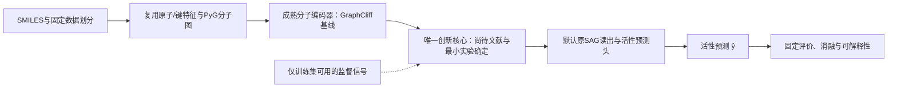

# 算法创新型论文的总体框架

## 2026-10-06 M28：当前状态

M28预算内完成18次RF拟合，1次重放核验失败、修复后17次结果有效；234/244五置乱、4792四置乱，正式gate未确认。真实特征现有结果均优于置乱，但不称完整通过或算法创新。不扩大训练，继续有界三问题审查。 见[全部结果与异常](../../experiments/reliability_base/permutation_report.md)。

## 2026-10-06：完整计划已授权，M28运行前

可靠性算法创新主线、8—12周投稿材料目标和分阶段预算已确定。当前算法核心未定；先18次RF内同维度置乱，再三问题有界审查。旧队列暂停，未通过不扩大。见[唯一当前总计划](reliability_publication_plan.md)，历史状态保留。

## 2026-10-06 M27：当前状态

M27零拟合简单对照通过：增强风险RF对作者式等权组合三任务改善2.67%/1.68%/0.37%，但方法特异性/跨seed/解释仍缺；当前只继续有限补证准备，0新fit/0test，旧队列暂停。下一步先固定同维度置乱对照，不叠加模块。作者特征seed固定0可候选复用，跨seed草案预算可降至36fit，尚未执行。 见[结果与边界](../../experiments/reliability_base/incremental_evidence_report.md)。

## 2026-10-06 M26：当前判断（优先于历史状态）

M26历史模块复核完成：实际退化、条件性收益、不完整实验及文献筛查已分开；5%仅为历史项目筛查规则。旧No-Go不改，旧队列继续暂停。唯一优先补证建议为三任务小幅正向的粗糙度风险增强，需先固定方法差异和新方案，本轮0训练/0test。目标为有可靠增量贡献的二区或核心论文，不保证录用。 见[完整复核报告](module_pause_review_20261006/report.md)。

## 2026-10-05 M25：当前状态

M25阶段A完成并独立核验：三任务seed42风险曲线改善2.08%/2.49%/3.76%，均值2.78%；未达训练前继续门槛，停止具体粗糙度增强候选，B不执行。这是小幅正向信号，不是粗糙度普遍无效。30/30fit、0官方test；固定六个失败/一般结构案例及解释局限已保留。方法贡献/跨seed/忠实度仍缺，发表目标未完成。见[阶段A结果与停止报告](../../experiments/reliability_base/phase_a_report.md)。

## M21历史状态

M21：用户确认以成熟公开项目为底座，不再限定GraphCliff。MIT粗糙度作者代码已原样跑通3次RF小样本接口，128train/32validation，部署特征标签依赖及作者纯校准接口通过，官方test使用0；UNIQUE为已审查但未运行参考。进入有限基线方案准备，尚无新方法效果结论。见[底座验收](../../experiments/reliability_base/README.md)。发表目标不变，旧队列暂停。

复用或组合思想不自动构成创新不足；成熟基线复现/接口运行允许先于新核心确定。正式改进实验仍需固定差异、预算与止损规则。下文G3只约束新方法正式验证，不阻止本轮已授权的基线工程验收；M18–M20的具体反证不撤销。

## M20历史状态

M20粗糙度方向差异审查完成：固定两仓库/14文件/9份Python静态核验；作者已有风险组合、GIN和粗糙度条件校准，UNIQUE已有误差模型，普通联合拒答亦有近邻。当前迁移/组合方案未形成算法贡献，保留0，不启动三任务训练；复核价值与算法贡献分开。见[差异审查](roughness_method_review_20261005/report.md)。发表目标仍未完成。

## M19历史状态

M19：重新核查单MCS匹配解释监督。3组合成控制/72次重编号通过；两任务48训练结构近邻对中43完成、5超时、0不同排名多重集充分证据，未达运行前结构门槛，停止该候选、保留0；无训练/test。见[结构审查报告](mcs_mask_audit_20261005/report.md)。M18及旧No-Go保留，创新核心仍空缺，发表目标未完成。

## M18历史状态

有界G1关键近邻审查、G2三个问题和G3筛查完成：非共有幅度监督、共有上下文差值、高低频交互加动态Loss均存在直接公开重叠，保留0个候选，暂停本轮选题；不进入G4，不恢复旧队列。发表目标未完成。见[近邻审查与停止报告](neighbor_audit_20261005/report.md)。

2026-10-05，用户明确：人工智能专业研一，优先算法创新型方法论文。最终目标仍是中科院二区发表；不自动转为评测论文，不保证录用。

**这是研究框架与实现边界，不是已经确定的新算法。** 已有GraphCliff、基线、数据/评价接口可以复用；唯一创新核心尚未确定。旧Cross-Attention/FPPool/加权Loss路线保持No-Go，不因建立新框架恢复训练。

## 当前任务与可复用结构（优先于历史GraphCliff约束）

单靶标活性预测及预测风险/接受决策：SMILES → 固定成熟特征/模型 → 活性预测ŷ与风险证据 → 校准/接受规则 → 评价与解释。本轮实际已跑的是作者RF＋训练邻域粗糙度及校准纯函数；主分子GNN待固定，没有空模型或新拒答头实现。

编码器、读出与维度继承所选公开基线，不固定38维GraphCliff/SAG接口。GraphCliff历史路径作为对照资产；选其他成熟模型时按其官方特征、输出、训练和权重契约验收。风险输入不包含查询y、cliff真值、错误或回顾性dirichlet/lipschitz；OOF样本的粗糙度仅用该折训练标签。

## 1. 历史GraphCliff架构（对照资产）

默认任务是每个靶标内的单分子活性回归：输入分子图G，输出活性ŷ。默认推理不依赖未知查询标签、cliff标签或参考活性；如果后续唯一合格候选确实需要训练参考，必须另行写明信息条件并使用对应对照，不沿用此默认假装无参考。

上图D为待决定的研究位置，不是新增的代码层。若最终创新是训练目标，推理图不插入额外模块；若创新是表征机制，则先固定普通MSE，只改一个明确机制。不同时改编码器、读出、Loss和参考选择后归因。

|组成|当前明确选择|实现身份／状态|
|---|---|---|
|数据|现有MoleculeACE/GraphCliff特征、train内validation；保留行号/哈希|已有工具；不重建数据平台|
|编码器|原GraphCliff AtomEncoder＋ShortGINE/LongPoly，作为第一对照底座|固定官方源码已复用；不宣称该编码器是我们的创新|
|创新核心|一个有明确文献差异、可证伪假设的机制|尚未确定；不写占位模块、工厂或空接口|
|默认读出|原SAGPooling＋Max/Mean|保持已有控制；不默认再加FPPool|
|默认预测头|现有图级回归head，单分子输出[B,1]|已有direct路径可复用；不是参考差值恢复|
|默认Loss|普通MSE，验证Overall MSE选择checkpoint|作为控制；不是最终创新承诺|
|解释|原子/子结构图＋同规模随机遮罩＋跨seed稳定性|最终必需；现有旧解释有限可复用，真实候选需重新验收|

可复用代码位置：`graphcliff_pair/vendor/model.py`（成熟编码/直接预测）、`graphcliff_pair/train.py`（已有训练和评价）、`graphcliff_pair/model.py`（历史Pair对照）。模型、训练代码和配置本轮不改。

## 2. 数据流与接口契约

- 单任务训练输入：PyG图批次，现有原子特征38维、键特征13维，标签y只给训练Loss；保存source_row和分区身份。默认H256/3层作为现有对照身份，不能未经核对说成所有作者方法的最佳设置。
- 推理输入：图的x/edge_index/edge_attr/batch；输出有限浮点[B,1]。历史GraphCliff编码输出[N,H]，SAG后Max/Mean读出[B,2H]。未来机制若改变尺寸，必须有明确适配和匹配控制。
- 训练监督与推理输入分开。训练对、triplet或统计量若被使用，仅由训练分区生成；不把查询真活性用于路由、检索或推理。使用训练参考的方案须显式报告ŷ=y_reference+Δŷ及参考检索条件。
- 标签沿本地实际y=-log10(nM)；若图中用pActivity则加9并标注，不称标准化标签。实际任务与文件身份优先于README泛化描述。
- 验证只选模型，不用test选择机制、超参或案例；冻结方法与解释规则后才进入一次最终评估。旧历史test资产不得当开发依据。
- 无键图、padding、节点/指纹顺序、canonical重叠与非法输入复用既有检查；遇身份不一致停止，不静默丢行或改划分。

## 3. 唯一创新核心的进入条件

后续只做一轮有界选题：最多三个具体研究问题，逐一核对最近原始论文和官方代码，最后保留零或一个。每个问题的交付必须包含：

1. **算法缺口**：现有方法缺少的具体能力，以及本地旧反证为什么没有已经覆盖这次改变。
2. **机制与位置**：在编码、读出或训练目标中的一个位置改变什么；给出运算/目标定义，而不是“加注意力提高表达能力”。
3. **最近方法差异**：逐项说明复用与新增部分、官方代码入口、许可、参数来源及未知事项。不能以GraphCliff＋公开模块作为充分原创性证据。
4. **最小反证实验**：成熟基线、去掉核心、最近方法/简单替代；数据、参考、Loss、初始化与预算各自匹配，参数匹配不等于计算匹配。
5. **论文机制证据**：解释怎样检验假设、必要的消融、跨任务/seed重复，以及提前固定的数值继续门槛和最大预算。

没有合格核心则暂停选题，不以总体框架已画好为由启动训练。门槛是项目筛查，不是二区期刊标准。当前没有合格候选，因此本文件不编造新Loss、超参、训练任务清单或效果承诺。

## 4. 实验、可解释性与发表验收

核心实验至少回答：新机制是否必要、是否优于最近方法或简单替代、收益是否跨任务/seed重复、成本是否合理、解释是否支持所声称的行为。总体/Cliff/Non-cliff RMSE在同一checkpoint报告；涉及差值时单列合法分区内pair指标，不能用分子误差冒充差值能力。

最终可解释性必须包括固定成功/退化/一般案例、真实与预测活性及误差、重要区域对随机同规模遮罩、跨seed稳定性；Pair候选另展示参考与差值。按[既定规范与接口限制](framework_review_20261005/explainability.md)执行。注意力或指纹热图仅辅助，不能代替忠实性或证明生物机制。

记录全部负结果、异常、中断、执行偏离和未知根因。训练前发布固定方案，实验后发布核验结果，每个有意义里程碑提交/push并核对远端SHA。写论文时明确贡献范围，不要求彻底解决悬崖或所有30任务领先。

## 5. 当前边界与下一交付

框架底座已明确，创新核心仍空缺；没有完整新算法、没有训练增益、没有投稿充分性结论。旧方法止损及原因见[当前停止报告](framework_review_20261005/decision.md)，历史产物见[实验台账](framework_review_20261005/inventory.md)。

执行顺序与硬门槛见[算法研究执行计划](algorithm_research_plan.md)。下一里程碑先接入Codex资料库aidd的文献清单/原文并建立已有方法边界表，再推导最多三个问题、保留零或一个核心。用户已提供29条文献整理，[附件接入与边界初表](literature_29_20261005/method_boundary.md)已核验；当前继续G1关键近邻公式/协议/代码核查，不能把初表当作核心选择完成。旧自动目标继续暂停。
