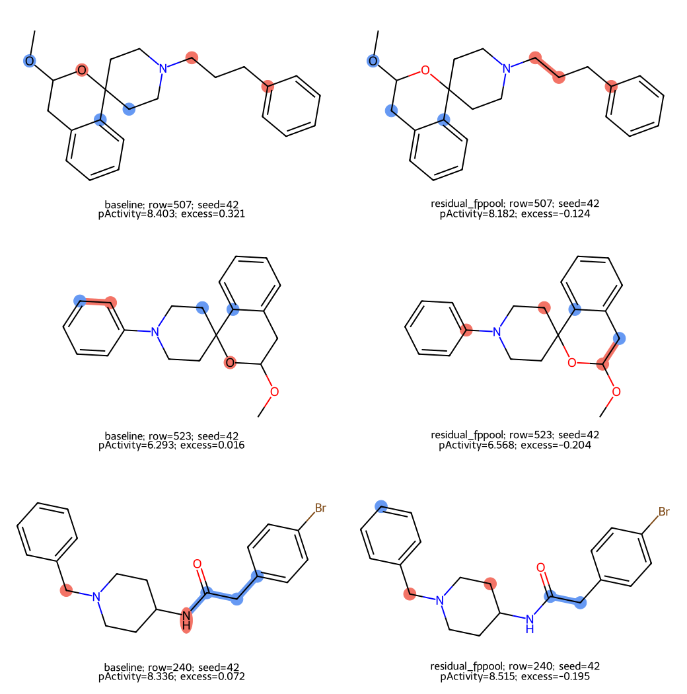
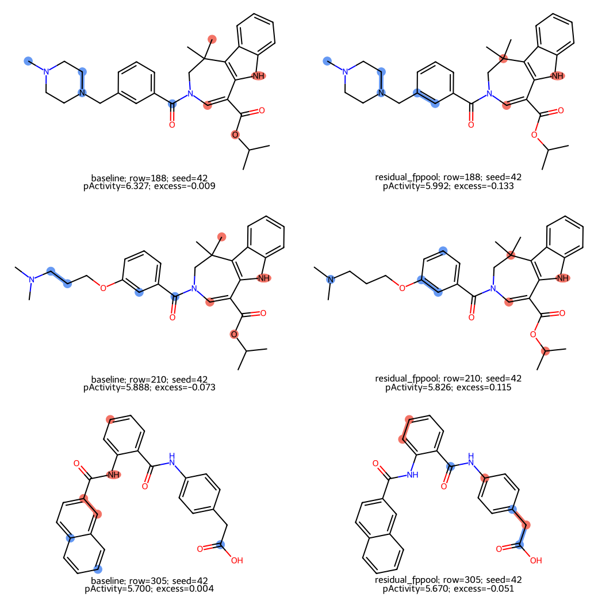

# 可解释性必需验收与已完成证据

**最终论文必须包含可解释性及忠实度/稳定性核验。** 它不必依赖Cross-Attention，也不能用热图弥补方法效果或创新不足。本轮所有方法候选No-Go，按用户计划复用有限失败案例与旧解释，不构建新的完整解释系统。

## 已完成、复算和未完成

旧原项目：287/2047，baseline/residual_fppool，三个种子共12checkpoint，157分子/942次解释。归因针对encoder隐藏节点，不是输入特征；固定20%（向上取整）原子置零，20个随机同大小集合在模型/种子共享。三seed稳定性有集合Jaccard及归因Spearman。

本轮重新核对942条记录的随机float32均值和超额变化，36行×4项聚合摘要一致；原权重/预测字节已绑定台账。旧checkpoint重放误差8.88e−16、跨图梯度0只作为当时的历史核验，本轮不称重新GPU重放或重算稳定性。

|任务|模型|top变化高于随机比例，三seed均值|跨seed top Jaccard，历史汇总|
|---|---|---:|---:|
|2047|baseline|0.627|0.215|
|2047|residual_fppool|0.542|0.201|
|287|baseline|0.654|0.207|
|287|residual_fppool|0.613|0.189|

以上不支持FPPool解释普遍更好；较大变化可能体现敏感或脆弱，不是预测更准或生物机制更正确。没有原子机制真值，不报告解释准确率。

## PyG接口核查

复用已安装PyG2.6.1的Explainer/GNNExplainer接口：direct、global/cross＋SAG、global/cross＋FPPool五种H32随机合成模型均通过全一节点特征mask精确恢复原输出、全零mask有限、参数不变。未运行解释mask优化、未更新模型、未重放训练checkpoint。细节见explanation_interface.json及tools/check_explanation_interface.py。

已安装版本的fidelity与unfaithfulness均明确拒绝regression；因此采用连续预测变化与随机基线，不直接套分类忠实度。原LongPoly有自定义propagate，PyG MessagePassing边mask不会自动证明覆盖它；本计划优先节点特征mask，不把默认edge_mask称完整GraphCliff解释。Pair需要固定reference的薄包装；本轮只核对query特征遮罩通路，参考侧、真实模型解释优化及高维训练规模未验收。

[PyG官方GNNExplainer文档](https://pytorch-geometric.readthedocs.io/en/2.6.1/generated/torch_geometric.explain.algorithm.GNNExplainer.html)给出接口；[Attention is not Explanation原始研究](https://aclanthology.org/N19-1357/)提示attention解释需要额外验证，不据其NLP结果断言本项目attention必然无效。

## 重启后不可省略的固定规范

- 候选及基线checkpoint均须先复现原验证预测，冻结模型参数；解释优化只允许更新解释mask。接口不兼容则停止/披露，不改模型救图。
- 在任何归因生成前固定每任务案例：按三个seed平均绝对误差差（baseline−candidate）排序，前3个改善案例、后3个退化案例及最接近中位差的3个一般案例；同分按source_row、去重，组不足报告数量。这些是相对误差类别，不暗示生物成功/失败；零差或没有改善时如实标注。
- 对验证全体作定量统计，图展示全部固定案例。只用validation预测/标签选图，不用test选机制；最终冻结后若解释test也沿用预设规则，不再改模型。
- 优先官方GNNExplainer节点object mask；原atom_fp、图拓扑保持固定。只有原模型可重放、mask依赖输出、参数无更新及回归设置检查通过后才生成解释；否则报告接口或解释失败。具体mask优化预算须随新候选训练方案提前固定，不猜未知最优值。
- 按mask重要性选ceil(20%原子)输入特征置零，与20个同大小随机集合比较abs(ŷ_mask−ŷ)，随机种子20261005和source_row绑定、模型/seed共享；同一batch形状与数值精度，不删除原子或重建指纹。无活性真值参与mask优化。图输入零特征有分布外风险，明确标注不是有效新分子或化学干预。
- 三个训练seed报告top集合Jaccard与重要性秩相关、全体/cliff/noncliff统计；常量/空集记NA并给原因，不靠看图改规则。Pair分别遮蔽query和reference的结构特征，参考活性固定，报告差值和恢复活性变化。
- 结构图显示模型、种子、单位、真实/预测活性与误差；pair图加参考结构、参考活性、真实/预测差值。若展示pActivity，用y+9转换并说明，不能将原y称标准化。
- 注意力/指纹权重仅辅助；mask统计与随机对照、跨seed稳定性必须同时发布。兼容性或忠实性不足时标明结果受限，不以热图包装机制。

## 已有有限案例，作为停止交付

以下直接复用旧v4按既有案例顺序固定的两任务各3个分子，展示全部6个，不重新挑图；不是本轮按成功/失败/一般规则新生成的解释，不宣称已经满足未来完整规范。图中红/蓝是隐藏表示有符号归因，pActivity是预测y+9，excess是top遮罩变化−随机平均。图含部分excess<0的反例，不隐藏。原图与本地来源逐字节一致，来源哈希见review_sources.json。

另外保留234已固定五加五去重8个失败cliff案例，见[有限难例报告](../../diagnostics/hard_case_audit_234/results.md)：全部在训练活性范围内、5个处于高尾、三个seed误差方向重复；既有数据没有支持同连接不同立体大活性差碰撞。它们说明已观察误差与排除范围，不是根因或图输入解释。

完整原始标签/SMILES/原子分数/随机遮罩留在原只读目录；本仓库只发布聚合、有限展示图和来源记录。本轮没有新增病例、训练、解释算法调参或test评估。
