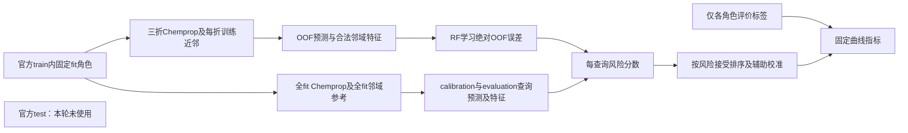

# M29：可靠性算法核心有界审查与停止报告

2026-10-06；基准代码11f056707a9797ebc96f511aa9a057e5eed28197。本轮仅文献、源码与既有结果审查，0新增拟合、0官方test。登记发生在检索中，属于事后整理，不伪装事前文献预注册。

## 决定与适用范围

三个问题中的直接改法均未同时具备“具体问题证据、可定位方法差异、可复用实现、低成本反证”。**保留0个算法核心，暂停当前选题的扩展训练，提交停止报告。** 不运行9次先导、seed43/44或30任务。该决定针对下述直接改法，不证明可靠性算法创新不可行，也不取消发表目标。粗糙度底座与正向结果保留，不自动转评测论文。

这是方法差异不足与问题证据不足的停止，不是要求每个部件首次提出，不是依据统一涨点门槛，也不是候选新算法已训练失败。M28置乱矩阵不完整，性能门槛为未确认，不能写为性能No-Go。

## 已执行的数据流与证据

OOF特征只用对应折训练分子标签；查询真值不进入风险推理。校准与evaluation角色独立；本轮没有新风险算法，也没有把calibration标签用于风险RF拟合。实际执行与边界见[M25](../../../experiments/reliability_base/phase_a_report.md)、[M27](../../../experiments/reliability_base/incremental_evidence_report.md)、[M28](../../../experiments/reliability_base/permutation_report.md)。

|任务|真实六接受率RMSE均值|置乱中位数|相对优势|置乱完整性|
|---|---:|---:|---:|---|
|234|0.7131408164093181|0.720714455002235|1.0509%|5/5|
|244|0.8533209659161770|0.8676347938869351|1.6498%|5/5|
|4792|0.7311028875629493|0.7424481315770137|1.5281%|4/5|

18次预算包含1次CSV解析精度导致的重放核验失败；修复后3真RF+14置乱有效，共17份结果。首次训练已完成但结果未接受。三个真实RF重放误差均小于1e-10；102个曲线数及17个保存模型重载已独立核验。缺4792第五次置乱，不自动增加第19次。现有优势支持保留特征匹配信号，不能证明化学因果、充分条件独立性或新算法贡献。

## 三问题与最近方法比较

这里的“最近”指机制最直接的原始方法，不声称穷尽最新文献。每题主方法最多3项，共9项；另2项辅助筛查/复用，共11关键来源。已有29条整理只作边界参考，28项独立研究；不是重新读取29篇全文，更不声称访问aidd全库。每项证据位置、官方入口、许可与版本见[来源记录](provenance.json)。

|问题|具体直接改法|核查主方法|已有内容与实际差异|当前决定|
|---|---|---|---|---|
|误差回归目标与接受排序|abs误差RF改成平方误差RF，或普通成对排序目标|SELE2019；JMLR2023 Optimal Strategies；SelectiveNet2019|任务损失回归、排序代理和选择风险目标已有；当前尚无分子任务特有的新运算或约束|直接迁移可作对照，尚不足定位方法贡献|
|邻域支持可靠性|按支持量门控普通/粗糙度风险，或常规收缩|RDN2016；粗糙度作者方法；UNIQUE|局部密度/偏差/精度可靠性、粗糙度风险组合、多特征误差模型已有；未测得当前低支持量失效，也未定义有差异的门控|保留问题，不保留未定义核心|
|OOF/部署参考规模迁移|匹配折模型与残差，或按规模简单缩放|jackknife+/CV+；J+aB2020；MAPIE实现|匹配预测与折外残差已有；与参考特征迁移不完全等价，当前没有规模偏差的因果证据及新校正公式|标准协议可作对照，尚非新风险算法|

### 问题1：确有目标差异的可能，尚无本项目证据

现有RF学习E[|e| | x]，固定接受曲线评价RMSE，给定接受数量时按E[e² | x]排序才直接最小化期望均方误差。两个期望不保证同序。例如A的误差幅度总为2，B以0.9概率为0、以0.1概率为10：E|e|分别2、1，而E e²分别4、10。此为数学反例，**不是三个任务观察到的分子失效**；RMSE均值也不等同所有覆盖率平方损失均值。

[JMLR2023](https://jmlr.org/papers/v24/21-0048.html)第3.3节已将任意任务损失作为回归目标，第3.4节给出SELE排序代理；[SELE2019](https://proceedings.mlr.press/v97/franc19a.html)学习条件风险次序；[SelectiveNet2019](https://proceedings.mlr.press/v97/geifman19a.html)结合选择风险、覆盖约束与辅助目标。因此，仅将abs改e²或搬来一般排序损失不能直接写成新提出算法。没有否定有针对性的增量改进，但当前没有定义该增量。

可证伪假设：平方风险对齐能稳定改善当前RMSE接受排序，而收益不是容量或参数差异。最低对照：普通abs RF、同配置e² RF、同容量标准排序方法、真正候选及去核心；共享点预测与角色，不调参。风险特征扰动应验证排序变化与核心运算一致，原子热图不能验证损失对齐。当前仅能定义已有基线改法，**不冻结新候选、不启动这些拟合**。

复用边界：SELE官方代码为Matlab/MATCONVNET，许可尚未确认；SelectiveNet官方示例侧重图像分类，当前环境、回归入口及许可未核验。不能声称已可直接运行，也不复制未确认许可代码。

### 问题2：支持量差异值得研究，但门控目前是未定义假设

固定k=10不等于相同有效支持；相似度分布及近邻相关性仍可变。现有generic已含nn_sim/local_dens，粗糙度加入nbr_disp/sali_mean。置乱信号不等于“低支持粗糙度一定有偏”或“RF无法学交互”。

[RDN原始论文](https://www.cs.kent.ac.uk/people/staff/aaf/pub_papers.dir/J-Cheminformatics-2016-Aniceto-Open-Access.pdf)方法部分已利用邻域密度、偏差、精度并调整邻域阈值。[粗糙度作者源码](https://github.com/krishnatheaverage/qsar-landscape-roughness)已有粗糙度、风险组合及邻域大小对照；[UNIQUE](https://github.com/Novartis/UNIQUE)已有多特征误差模型。三者不证明所有未来粗糙度门控都已发表，但足以要求说清新增运算，不能仅改名为支持感知风险。

候选族可表达为r=(1-g(s))*r_base+g(s)*r_rough，其中s是合法训练参考的支持证据；**g尚未定义、参数未冻结，这不是算法定义或保留方案**。可证伪假设是：支持量在固定风险预测之外解释粗糙度误判，明确约束的修正优于RF已有交互。当前无条件误差证据，不能编造该问题已被观察。

最低反证：普通增强RF、仅支持量对照、同容量允许交互的误差模型、候选/去核心；固定支持分组规则与不含查询标签的参考扰动。解释须验证风险变化与支持证据，不能把训练近邻图当化学因果。作者MIT/UNIQUE BSD代码可复用，完整UNIQUE流水线未运行；RDN官方可执行实现未定位。

### 问题3：训练参考规模确不同，影响原因尚未确认

三折OOF使用约2/3 fit，部署全fit；这个协议差异已存在。不能仅凭规模不同就断言当前风险不准由它造成，主预测残差分布及参考特征都可能改变。

[jackknife+/CV+](https://arxiv.org/abs/1905.02928)第3节将对应折查询预测与折外残差配对，[J+aB](https://proceedings.neurips.cc/paper/2020/hash/2b346a0aa375a07f5a90a344a61416c4-Abstract.html)利用对应子采样模型与残差，[MAPIE](https://github.com/scikit-learn-contrib/MAPIE)提供现成保形工具。这些并不自动修复分子邻域特征迁移，保形区间也不是一个现成的新风险排序RF。不可把其覆盖保证移植到当前方法。

可证伪假设：在隔离其他变化后，参考一致性带来风险排序改善。最低对照需要相同点预测下的参考特征变化，以及匹配折推理协议；若改变点预测则单独计模型成本和信息量。所有参考只用合法训练角色，不能用query y。解释检查尺度/近邻扰动的分数变化。当前没有明确新校正公式和受控规模效应，不能把简单比例缩放或直接套CV+称创新。MAPIE BSD许可已核验，但适配和运行未验证；Merck/puqsar仅辅助复用筛查，不新增第四个主问题。

## 停止报告：事实与原因分开

**观察事实。** 三任务seed42的粗糙度增强对普通RF及简单组合小幅改善；M28两完整、一部分置乱同向；正式置乱gate未确认。三个直接改法未形成新算法定义或新实验结果；其他seed、30任务、完整解释未执行。

**已支持解释。** 小幅收益并非必须达到统一3%/5%才有研究价值。真实特征匹配比当前置乱更好，支持保留底座。损失回归/排序、局部可靠性、多特征风险学习、折预测残差匹配已有明确原始方法；当前简单迁移不能单独支撑方法贡献。首次重放失败有CSV读取证据，round-trip修复后通过，属于技术问题而非性能反证。

**待验证假设。** 平方损失目标更适合当前排序；低支持粗糙度会误导风险；参考规模变化造成风险迁移。三者均未确认为当前瓶颈，不能把可能原因写进论文结论。

**未知原因。** 无法判断候选未来能否改善、幅度及跨任务稳定性；无法从历史退化推导过拟合或噪声；置乱打破其他联合关联，不能定位唯一化学机制。未确认接口不能当忠实解释；没有新核心时不建设完整解释系统。

**停止理由及改变判断条件。** 贡献与问题证据缺口优先于成绩大小。目前没有可直接冻结的独特运算与低成本反证，因此按授权计划暂停当前选题扩展。改变判断需要一个实际可复核失效、精确定义的增量机制及与最近方法的区别、许可可复用入口和固定成本的反证方案。补第19次置乱或盲目多seed本身不能填补方法差异；若未来另行授权补证，应独立记新预算，不改M28。

|审查维度|已具备|关键缺口|决定|
|---|---|---|---|
|贡献差异|底座及三问题边界明确|0个具体增量算法核心|不进入先导|
|对照公平性|固定点预测/角色/配置，公开置乱聚合|4792缺1置乱；最近方法尚无统一运行|不称完整通过|
|跨任务重复性|3任务1seed探索|43/44及完整任务未执行|不补种子救创新|
|解释可信度|既有6例及局限；完整解释计划保留|原子/风险忠实度与跨seed未交付|不标论文完成|
|计算成本|M28严格18fit，M29为0fit|扩大训练目前无明确核心价值|停止扩展|

## 交付、异常与下一决定

修改当前状态文档、此报告、来源及决策JSON；原GraphCliff/my_work、历史No-Go、旧协议/模型/逐分子数据只读。来源网络内容未下载逐字归档时SHA记null；不编造网页哈希，论文证据与README证据分别记录。运行拟合计划/实际均0；M28预算与失败由原日志继承。没有安装依赖、复制第三方代码或额外参数搜索。

最低核验：来源总数≤12、每问题主来源≤3；本地证据SHA、M28表格/运行数、理论反例、文档链接、Git提交范围与远端一致。论文目标未完成，本轮完成的是第一阶段审查与规定的停止交付，不宣称8—12周计划全部完成。
